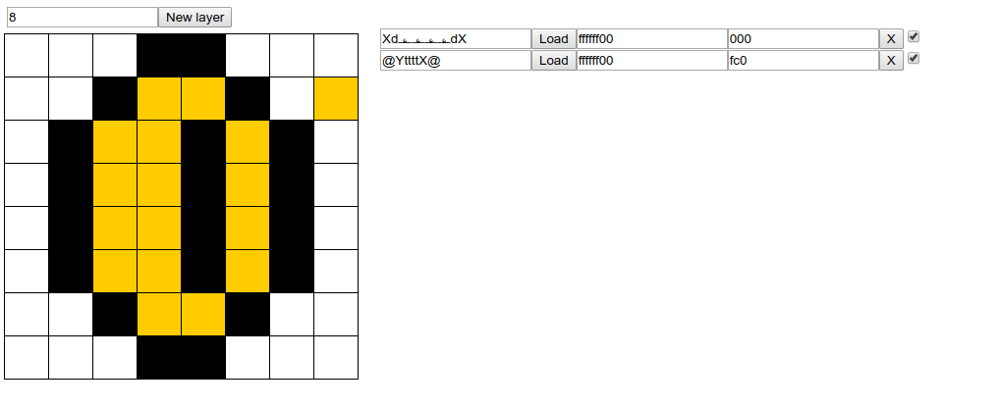

# Tile editor

A layering tile painter for code golfing.

- Create 8 bit pixel art and generate a miniature hash that represents it.
- Load an existing hash
- Create layers and test out color schemes (supports any web hex color pattern, without the '#')

